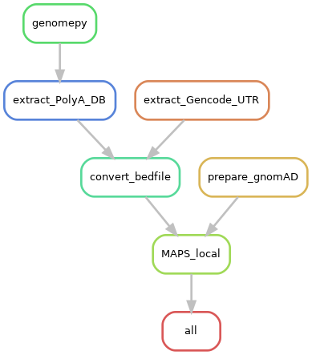
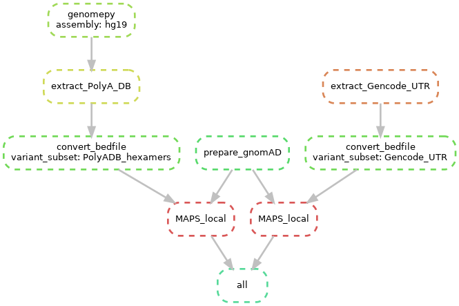

# 3' UTR-variants

Identify variants occurring in 3’ UTRs that could disrupt the function of a transcript.

This project involves:

- retrieving reference genome using [genomepy](https://github.com/vanheeringen-lab/genomepy)
- extracing 3'UTR regions from gene annotation
- extracting PAS hexamers from [PolyA_DB3](https://exon.apps.wistar.org/polya_db/v3/misc/download.php)
- computing MAPS score on different 3'UTR variants locally and on the cloud using [hailctl dataproc](https://hail.is/docs/0.2/cloud/google_cloud.html)

## Evaluation Metrics

TODO: explain MAPS etc.

## Repository Files

The repository mainly contains Snakefiles for `snakemake` pipeline rules in `rules/` and python scripts in `scripts/`.
Additionally, there is a `qc/` directory for any exploratory analysis on input databases.

The Snakefiles in `rules/` are used by the `Snakefile` in the repository root and cannot be run independently.
Input paths, URLs and parameters are collected in `config.yml` and should be adapted by the user.
The python scripts are linked to the snakemake objects that are passed when the pipeline is called, but some scripts can be run by themselves as well.
How the python scripts are used is best demonstrated in the snakemake rules, where input and output files are defined.
More information on scripts in snakemake pipeline is documented [here](https://snakemake.readthedocs.io/en/stable/snakefiles/rules.html#external-scripts).

## Pipeline

The workflow is implemented as a `snakemake` pipeline.
A good resource on the idea of `snakemake` and how it works is its official [documentation](https://snakemake.readthedocs.io/en/stable/).

### Installation

The dependencies are available as a conda environment.

```commandline
conda env create -f environment.yml
conda activate utr-variants
```

The pipeline can run `hail` operations locally or on the Google Cloud Platform (GCP).
In order to run locally, you need to install the `gcs-connector` in the new environment.

```shell script
curl -sSL https://broad.io/install-gcs-connector | python
```

### Configuration

The `config.yml` file contains links to hail datasets and local files.
Local input files and output directories can be modified accordingly.
For GCP runs, keys `bucket` and `cluster` need to be specified, and the key `local` needs to be set to `false` in the `config.yml`.

```yaml
bucket: bucket_name
cluster: cluster_name
local: false
```

For `bucket` you need to give the GCP storage bucket name you want your output to be stored in, while `cluster` defines the name of the `hailctl dataproc` cluster.
Before calling the `snakemake` pipeline, start the `dataproc` session, preferrably with a compute timeout.

```commandline
hailctl dataproc start cluster_name --max-age=2h
```

The pipeline runs locally, if `local` is set to `true`.
In that case, the `bucket` and `cluster` keys do not need to be specified.

### Call the Pipeline

In order to call the pipeline, simply run

```commandline
snakemake -n
```

for a dry run, or

```commandline
snakemake -j 10
```

to invoke the scripts, where `-j` or `--cores` sets the number of cores to be used.

### Workflow Graph

It is useful to get a visual representation of what will be computed.
For that, you can call the `dependency` rule that creates graphs for the dependency between rules (more general) and jobs (specific to wildcards).

```commandline
snakemake dependency -Fn
```

The output files can be found in the `output_root` directory specified in `config.yml`.
Below are some examples of a local run.

#### Rule graph for local run



#### Job graph for local run


