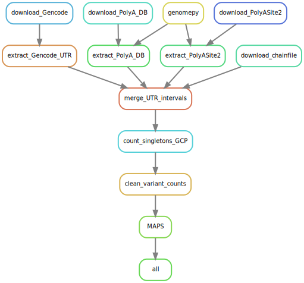
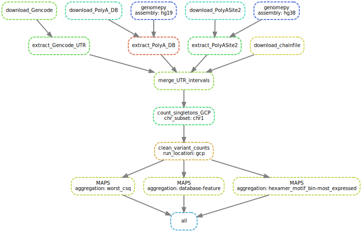

# 3' UTR-variants

Identify variants occurring in 3’ UTRs that could disrupt the function of a transcript.

This project involves:

- retrieving reference genome using [genomepy](https://github.com/vanheeringen-lab/genomepy)
- extracting 3'UTR regions from gene annotation
- extracting PAS hexamers from [PolyA_DB3](https://exon.apps.wistar.org/polya_db/v3/misc/download.php)
- computing MAPS score on different 3'UTR variants locally and on the cloud using [hailctl dataproc](https://hail.is/docs/0.2/cloud/google_cloud.html)

## Evaluation Metrics

The different 3' UTR variants are evaluated by the MAPS (mutability-adjusted proportion of singletons) score to measure the overall depletion of singletons, as described in the [gnomAD flagship paper](https://doi.org/10.1038/s41586-020-2308-7).
A higher MAPS score (compared to a baseline) suggests that there is a stronger evolutionary selection against the variant group.

## Repository Files

The repository mainly contains a Snakemake workflow in `workflow` and a python package in `utr3variants` for the functions used in the pipeline scripts.
Input paths, URLs and parameters are collected in `configs/config.yml` and should be adapted by the user.
Additionally, there is a `qc/` directory for any exploratory analyses on input databases.

The Snakemake file structure under `workflow` is organised [as recommended](https://snakemake.readthedocs.io/en/stable/snakefiles/deployment.html) by the Snakemake documentation.
It contains Snakefiles for Snakemake pipeline rules in `rules/` and python scripts in `scripts/`.
The Snakefiles in `rules/` are used by the `Snakefile` in the repository root and cannot be run independently.
Snakemake objects are passed to the python scripts when the pipeline is called locally.
However, scripts that are to be submitted to the GCP do not handle Snakemake objects and can be run independently as well.
How the python scripts are used, is best demonstrated in the Snakemake rules, where input and output files are defined.
More information on scripts in Snakemake pipelines is documented [here](https://snakemake.readthedocs.io/en/stable/snakefiles/rules.html#external-scripts).

## Pipeline

The workflow is implemented as a Snakemake pipeline.
A good resource on the idea of Snakemake and how it works is its official [documentation](https://snakemake.readthedocs.io/en/stable/).

### Installation

The dependencies are available as a conda environment.

```commandline
conda env create -f environment.yml
conda activate utr-variants
```

The pipeline can run `hail` operations locally or on the Google Cloud Platform (GCP).
In order to run locally, you need to install the `gcs-connector` in the new environment.

```shell script
curl -sSL https://broad.io/install-gcs-connector | python
```

### Configuration

The `configs/config.yml` file contains links to `hail` datasets and local files.
Local input files and output directories can be modified accordingly.
For GCP runs, keys `bucket` and `cluster` need to be specified, and the key `local` needs to be set to `false` in the `config.yml`.

```yaml
bucket: bucket_name
cluster: cluster_name
local: false
```

The key `bucket` specifies the GCP storage bucket name you want your output to be stored in, while `cluster` defines the name of the `hailctl dataproc` cluster.
Before calling the Snakemake pipeline on the GCP, you need to start the `dataproc` session, preferably with a compute timeout.

```commandline
hailctl dataproc start cluster_name --max-age=2h --packages gnomad
```

You don't need to start a `dataproc` session, if you want to run the pipeline locally, setting `local` to `true`.
In that case, the `bucket` and `cluster` keys do not need to be specified.

### Call the Pipeline

The pipeline was configured to be called from the root directory of this repository.
For a dry run, you can supply the `-n` argument:

```commandline
snakemake -n
```

In order to executed the steps listed in the dry run, use `-j` or `--cores` to set the number of cores available to the pipeline:

```commandline
snakemake -j 10
```

### Workflow Graph

It is useful to get a visual representation of what will be computed.
For that, you can call the `dependency` rule that creates graphs for the dependency between rules (more general) and jobs (specific to wildcards).

```commandline
snakemake dependency -fj
```

Here, `-f` enforces the pipeline to overwrite any pre-existing dependency graphs.

The output files can be found in the `output_root` directory specified in `configs/config.yml`.
Below are some examples of a local run.

#### Rule graph for GCP run



#### Job graph for GCP run


